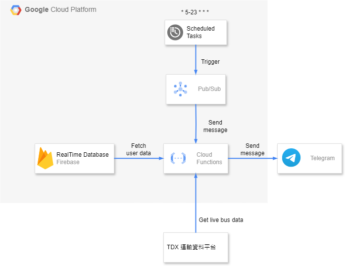

# taiwan-bus-tracker-telegram-bot
> Reference: [Cloud Pub/Sub Tutorial (2nd gen)](https://cloud.google.com/functions/docs/tutorials/pubsub#functions-deploy-command-python) 
# System flow



# Cloud Function deploy command
```cli
gcloud functions deploy bus_auto_tracker --gen2 --runtime=python311 --region=us-central1 --source=. --entry-point=subscribe --trigger-topic="auto_check_bus_status"
```

# RealTimeDB Schema
> reference page: https://ebus.gov.taipei/EBus/VsSimpleMap?routeid=0100067200&gb=1

```json
{
  "user": {
    "Telegram_user_id": {
      "Taipei": [
        {
          "672": [
            {
              "StopSequence": 7,
              "direction": 1
            }
          ]
        }
      ]
    }
  }
}
```
